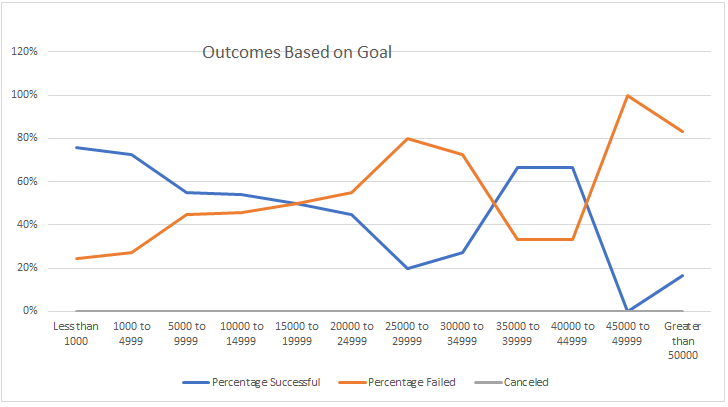
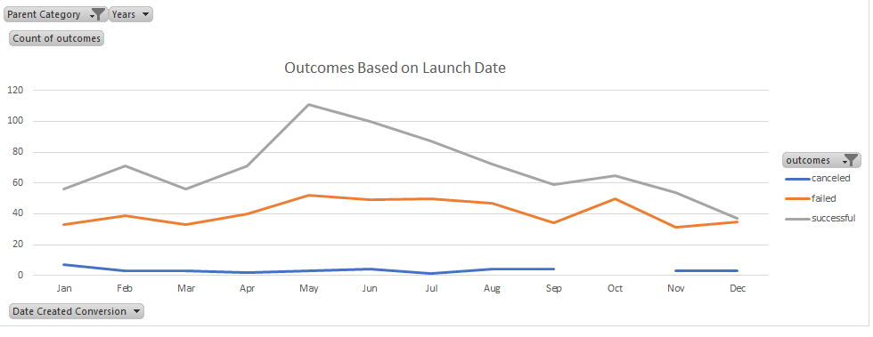

#Kickstarter Project

##A Kickstarter is any innovative project that is brought to life through direct support of others also known as crowd funding.  In this project Louise "a playwrite" is seeking to understand what are the contributing factors to a sucessful crowd funding campaign

###The Purpose of this analysis is to give Louise a clear idea of how the outcome of her "Kickstarter", in terms of its sucessfullness in reaching her desired goal amount, might be affected by the funding goal as well as the launch date of the Kickstarter.

##Analysis and Challenges

###Analysis of Outcomes based on Goals

The analysis of how projects fared based on their funding goals was conducted in the following way. A table was created in which "Funding Goals" were catagoried for less than 1000, then in increments of 5000 up to 50,000, then finally goals that exceeded 50,0000. Further to this I calculated the total number of project that were successful, failed and canceled using Countifs arguments based on the data in the Kickstarted excel file.  Finally the percentage of successful, failed and canceled projects were evaluated by dividing the number of sucessful, failed and canceled plays by their respective totals.A "Line Graph" was created for visual representation

###Analysis of Outcommes based on Launch Date

The analysis of how projects fared based on their launch date was conducte in the following way. Frsly a pivot table was created based on the entire Kickstarter dataset.  Secondly filters baed on years and parent category was added.  Thirdly an ungrouping of the "Date Created Conversion" was done to facilitate evaluation based on months.  Finally and very importantly for our analysis column categories that would display: sucessful, failed and canceled was added.  A Pivot chart was created for visual representation

###Challenges and Difficulties Encounted

The challenges and difficulties were few due to the fact that company provided mainly clean data, only in perhaps two columns an IfError function needed to be applied.  The other area that was a challenge was parsing the date but after discussing with teamates this task was quickly accomplished

##Results

Based on the launch date we can conclude that the months of May and June are perhaps the best months to kick off projects, as we can observer that in these months 111 and 110 projects respectively were successful.  This might be duely noted by insiders as we can see that these months are the months in which most prjects are submitted 166 in May and 153 in June.  Another conclusion we can make is that there is not a strong corelation between months and if projects are cancelled. It may be that the reasons for cancellation is outside the scope of information provided.

In terms on outcomes based on goals we can conclude that relatively inexpensive projects that are just under 5000 or less are very likely to suceed with 80% of them having a sucess rate and only 20 percent failing. Another conclusion we can make is that projects in the 25,000 to 29,000 are least sucessful as we can observe from the line graph that in this interal sucess is at a lowest and failure rates are at its highest peak simultaneously.

Some limitations of this dataset is that we may do not have additonal information that may give us insight as to how income stators may influence funding.  For example we are unable to tell why there is an uptick in funding for projects that are in the category of 30,000 to 40,000, are there pockets of affluent people who only invest in mid-range expensive projects? 

For futher analysis we might also have created line graphs that examined how successful campaigns are based on lenght of campaign i.e. including a line chart that uses "Date Ended Conversion"
